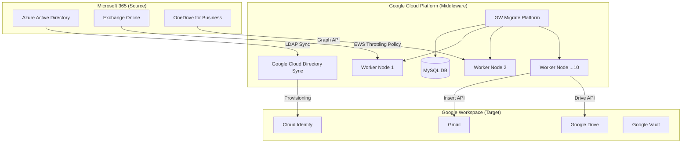
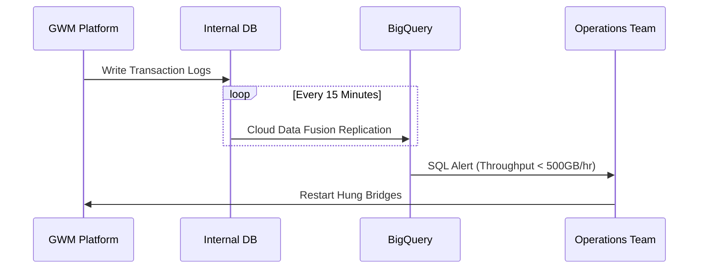

# Architects Implementation Guide: M365 to Google Workspace

**Version**: 1.0
**Scope**: 5,000 Users (Tech & Data Teams)
**Target Date**: April 30, 2026

## 1. Executive Summary
This proposal outlines the technical strategy for migrating 5,000 high-complexity users from Microsoft 365 to Google Workspace. Unlike standard "lift-and-shift" operations, this migration prioritizes **data fidelity for engineering assets**, **API-driven automation**, and **strict compliance governance**.

## 2. Solution Architecture

### 2.1 Hybrid Identity & Infrastructure Topology
The following diagram illustrates the coexistence of Azure AD (Source) and Google Workspace (Target), bridged by Google Cloud Directory Sync (GCDS) and the Migration Infrastructure.

## 3. Technical Strategy

### 3.1 Google Workspace Migrate (GWM) Scaling
To meet the aggressive April deadline, we will deploy a **Sharded Bridge Architecture** to bypass the undocumented bridge performance limits.

*   **Infrastructure**: 10x `n1-standard-8` nodes managed via Terraform.
*   **Sharding Logic**:
    *   **Maximum Users per Bridge**: 100
    *   **Total Bridges**: ~50
    *   **Assignment**: Automated via PowerShell (`Assign-UserBatch.ps1`).

### 3.2 Data Fidelity & "The OneNote Gap"
OneNote notebooks do not have a direct API equivalent in Google Drive.
*   **Strategy**: "Frozen Archive"
*   **Execution**:
    1.  **Inventory**: Identify heavy OneNote users via Graph API.
    2.  **Conversion**: Users export active notebooks to PDF/Docx.
    3.  **Archive**: Automated Rclone transfer of `.one` files to "Cold Storage" Shared Drives (read-only backup).

## 4. Automation & Tooling

### 4.1 Zero-Touch Provisioning
All migration infrastructure is defined as code (IaC) to ensure rapid recovery and consistent configuration.

| Component | Tooling | Configuration File |
|-----------|---------|--------------------|
| **Infrastructure** | Terraform | `infrastructure/terraform/environments/migration-prod/data.csv` |
| **GWM Installation** | PowerShell | `automation/powershell/install_config.json` |
| **Workspace Topology** | GAM | `automation/gam/setup_workspace.sh` |

### 4.2 Monitoring & Observability
We reject the unreliable native GWM reporting in favor of raw log analysis.

## 5. Security & Governance

### 5.1 IAM Permission Model
Service Accounts are strictly scoped using the principle of least privilege.
*   **GWM Service Account**: `https://www.googleapis.com/auth/migrate.deployment.interop`
*   **GAM Admin**: Restricted to `admin.directory.*` and `gmail.settings.basic`.

### 5.2 Verification Standard
*   **Automated**: <1% Item Count Variance (Source vs. Target).
*   **Manual**: "White Glove" verification of Calendar Resources and Recurring Meetings for VIPs.
